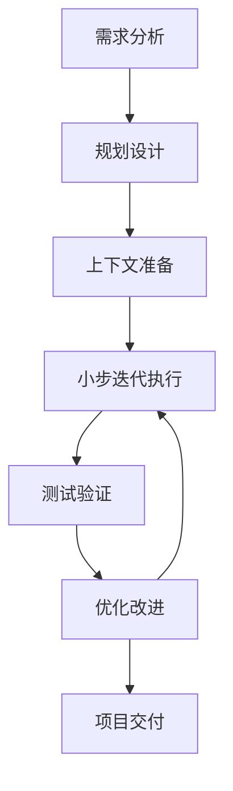

# Vibe Coding 工作流程

## 1. 整体工作流程

Vibe Coding 的核心工作流程可以概括为：**规划驱动 + 上下文固定 + AI 结对执行**。这三个要素相互配合，形成一个完整的开发闭环。



## 2. 详细工作流程

### 2.1 阶段一：需求分析与规划

#### 步骤 1：需求收集与分析
- **输入**：用户需求描述
- **输出**：需求分析报告
- **AI 角色**：产品经理
- **具体任务**：
  1. 收集和整理用户需求
  2. 分析需求的可行性和合理性
  3. 识别核心需求和非核心需求
  4. 生成需求分析报告

#### 步骤 2：技术选型与架构设计
- **输入**：需求分析报告
- **输出**：技术选型报告和架构设计文档
- **AI 角色**：架构师
- **具体任务**：
  1. 评估各种技术栈的适用性
  2. 选择最合适的技术栈
  3. 设计系统架构和模块划分
  4. 定义接口和数据模型
  5. 生成架构设计文档

#### 步骤 3：实施计划制定
- **输入**：架构设计文档
- **输出**：详细的实施计划
- **AI 角色**：项目管理器
- **具体任务**：
  1. 分解项目为可管理的小任务
  2. 确定任务的优先级和依赖关系
  3. 制定详细的时间计划
  4. 生成实施计划文档

### 2.2 阶段二：上下文准备

#### 步骤 4：记忆库创建
- **输入**：实施计划
- **输出**：记忆库结构
- **AI 角色**：知识管理员
- **具体任务**：
  1. 创建记忆库目录结构
  2. 整理和存储项目相关文档
  3. 建立文档之间的关联
  4. 确保记忆库的完整性和一致性

#### 步骤 5：上下文注入
- **输入**：记忆库内容
- **输出**：上下文配置
- **AI 角色**：上下文管理器
- **具体任务**：
  1. 分析项目上下文需求
  2. 选择合适的上下文注入策略
  3. 配置上下文管理系统
  4. 验证上下文注入效果

### 2.3 阶段三：迭代执行

#### 步骤 6：模块开发
- **输入**：实施计划和上下文
- **输出**：功能模块
- **AI 角色**：开发者
- **具体任务**：
  1. 按照实施计划开发模块
  2. 编写高质量的代码
  3. 实现模块的核心功能
  4. 编写单元测试

#### 步骤 7：代码审查
- **输入**：开发的模块
- **输出**：审查报告
- **AI 角色**：代码审查员
- **具体任务**：
  1. 审查代码质量和风格
  2. 检查功能实现的正确性
  3. 识别潜在的性能和安全问题
  4. 提供改进建议

#### 步骤 8：测试验证
- **输入**：审查后的模块
- **输出**：测试报告
- **AI 角色**：测试工程师
- **具体任务**：
  1. 设计和执行测试用例
  2. 验证功能的正确性
  3. 检测和报告缺陷
  4. 验证缺陷修复

### 2.4 阶段四：优化与交付

#### 步骤 9：性能优化
- **输入**：测试报告
- **输出**：优化后的代码
- **AI 角色**：性能优化专家
- **具体任务**：
  1. 识别性能瓶颈
  2. 设计性能优化方案
  3. 实施优化措施
  4. 验证优化效果

#### 步骤 10：文档完善
- **输入**：优化后的代码
- **输出**：完整的项目文档
- **AI 角色**：文档专家
- **具体任务**：
  1. 更新项目文档
  2. 编写用户手册
  3. 整理技术文档
  4. 确保文档的完整性和准确性

#### 步骤 11：项目交付
- **输入**：完整的项目
- **输出**：交付报告
- **AI 角色**：交付经理
- **具体任务**：
  1. 准备交付材料
  2. 执行最终测试
  3. 生成交付报告
  4. 完成项目交付

## 3. 记忆库管理

### 3.1 记忆库结构

```
memory-bank/
├── architecture.md         # 架构设计文档
├── implementation-plan.md  # 实施计划
├── progress.md             # 进度记录
├── tech-stack.md           # 技术栈选择
└── requirements.md         # 需求文档
```

### 3.2 记忆库更新流程

1. **初始化**：创建记忆库目录结构
2. **填充**：添加初始文档
3. **更新**：在每个里程碑后更新相关文档
4. **维护**：定期清理和优化记忆库内容
5. **备份**：定期备份记忆库

### 3.3 上下文管理策略

1. **全局上下文**：项目级别的上下文信息
2. **任务上下文**：特定任务的上下文信息
3. **角色上下文**：特定角色的上下文信息
4. **上下文注入**：在执行任务时注入相关上下文
5. **上下文更新**：根据任务执行结果更新上下文

## 4. AI 结对编程模式

### 4.1 多模型协作

| 模型类型 | 适用场景 | 优势 |
|---------|---------|------|
| Claude Opus 4.5 | 复杂推理、代码生成 | 推理能力强，代码质量高 |
| gpt-5.1-codex | 代码生成、技术文档 | 代码理解和生成能力强 |
| Gemini 3.0 Pro | 多模态、创意生成 | 多模态处理能力强 |

### 4.2 协作流程

1. **任务分配**：根据任务类型分配给合适的模型
2. **并行执行**：多个模型并行处理不同任务
3. **结果整合**：整合多个模型的输出结果
4. **质量控制**：对整合结果进行质量检查
5. **反馈循环**：根据执行结果调整模型选择和提示词

### 4.3 提示词策略

1. **基础提示词**：通用的任务描述
2. **角色提示词**：特定角色的专业提示词
3. **场景提示词**：特定场景的定制提示词
4. **优化提示词**：根据反馈优化的提示词
5. **进化提示词**：通过自我进化生成的提示词

## 5. 质量保证

### 5.1 代码质量

1. **代码审查**：AI 自动审查 + 人类审核
2. **测试覆盖**：单元测试 + 集成测试 + 端到端测试
3. **代码规范**：遵循行业标准和项目规范
4. **性能测试**：评估代码性能和资源使用
5. **安全审查**：检查潜在的安全漏洞

### 5.2 项目质量

1. **需求跟踪**：确保所有需求都被实现
2. **文档完整性**：确保文档与代码一致
3. **测试覆盖率**：确保测试覆盖关键功能
4. **性能指标**：监控和优化系统性能
5. **用户体验**：确保系统易于使用

## 6. 工具集成

### 6.1 开发工具

| 工具 | 用途 | 集成方式 |
|------|------|----------|
| Visual Studio Code | 代码编辑 | 插件集成 |
| Git | 版本控制 | 命令行集成 |
| CI/CD | 持续集成 | 配置文件 |
| Docker | 容器化 | Dockerfile |
| Mermaid | 图表生成 | 插件集成 |

### 6.2 AI 工具

| 工具 | 用途 | 集成方式 |
|------|------|----------|
| Claude Code | 代码生成 | API 集成 |
| Codex CLI | 代码生成 | 命令行集成 |
| Gemini CLI | 多模态处理 | 命令行集成 |
| Ollama | 本地模型 | 本地集成 |

## 7. 最佳实践

### 7.1 项目管理

1. **小步迭代**：将大任务分解为小任务
2. **持续集成**：频繁提交和测试
3. **版本控制**：使用 Git 管理代码版本
4. **文档先行**：先编写文档，再实现代码
5. **定期回顾**：定期回顾项目进展和问题

### 7.2 开发实践

1. **接口先行**：先定义接口，再实现功能
2. **测试驱动**：先编写测试，再实现代码
3. **模块化设计**：按功能划分模块，职责清晰
4. **代码复用**：重用现有代码和库
5. **性能优化**：关注代码性能和资源使用

### 7.3 AI 协作

1. **清晰沟通**：明确表达需求和期望
2. **渐进式提示**：先给出概述，再逐步细化
3. **反馈循环**：根据输出调整提示词
4. **多模型协作**：利用不同模型的优势
5. **持续学习**：从每次交互中学习和改进

## 8. 常见问题与解决方案

### 8.1 代码质量问题

| 问题 | 原因 | 解决方案 |
|------|------|----------|
| 代码质量差 | 提示词不明确 | 优化提示词，明确质量要求 |
| 功能实现错误 | 需求理解偏差 | 提供更详细的需求描述 |
| 性能问题 | 算法选择不当 | 明确性能要求，提供性能测试 |
| 安全漏洞 | 安全考虑不足 | 增加安全审查步骤 |

### 8.2 项目管理问题

| 问题 | 原因 | 解决方案 |
|------|------|----------|
| 进度延迟 | 任务分解不合理 | 重新分解任务，调整计划 |
| 范围蔓延 | 需求不明确 | 明确需求边界，避免范围蔓延 |
| 沟通不畅 | 信息传递不及时 | 建立定期沟通机制 |
| 质量问题 | 测试覆盖不足 | 增加测试用例，提高测试覆盖率 |

### 8.3 AI 协作问题

| 问题 | 原因 | 解决方案 |
|------|------|----------|
| 输出质量不稳定 | 模型波动 | 使用多模型协作，取最佳结果 |
| 上下文丢失 | 对话过长 | 定期清理上下文，保持对话简洁 |
| 创意不足 | 提示词限制 | 调整提示词，鼓励创意输出 |
| 执行偏差 | 指令不明确 | 提供更详细、更具体的指令 |

## 9. 结语

Vibe Coding 是一种全新的编程范式，它通过规划驱动、上下文固定和 AI 结对执行，实现了从想法到可维护代码的高效转化。通过遵循本文档描述的工作流程，开发者可以充分发挥 AI 的能力，同时保持对项目的控制和理解。

成功的 Vibe Coding 实践需要：
1. 清晰的规划和目标
2. 高质量的上下文管理
3. 有效的 AI 协作策略
4. 严格的质量控制
5. 持续的学习和改进

随着 AI 技术的不断发展，Vibe Coding 将成为未来软件开发的重要方式，为开发者带来更高的效率和更好的开发体验。