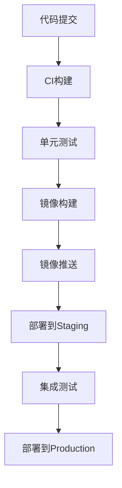

# DevOps 部署方案模板

## 1. 项目信息

| 项目名称 | 版本 | 负责人 | 最后更新 |
|---------|------|--------|----------|
| 项目名称 | v1.0.0 | DevOps工程师 | 2024-01-01 |

## 2. 部署概述

### 2.1 部署架构
- **部署方式**: [如：容器化部署、虚拟机部署、Serverless等]
- **编排工具**: [如：Kubernetes、Docker Compose、ECS等]
- **CI/CD**: [如：GitHub Actions、GitLab CI、Jenkins等]
- **监控**: [如：Prometheus、Grafana、ELK等]

### 2.2 部署流程图



## 3. CI/CD 配置

### 3.1 构建流水线

| 阶段 | 工具 | 触发条件 | 超时 |
|------|------|---------|------|
| Lint | flake8/mypy | PR | 5min |
| Test | pytest | PR | 15min |
| Build | Docker | main push | 10min |
| Deploy | kubectl | tag push | 10min |

### 3.2 环境配置

| 环境 | 用途 | URL | 分支 |
|------|------|-----|------|
| Development | 开发测试 | dev.example.com | feature/* |
| Staging | 预发布验证 | staging.example.com | main |
| Production | 生产环境 | app.example.com | release/* |

## 4. 容器化配置

### 4.1 Dockerfile 关键配置

```dockerfile
FROM python:3.9-slim
WORKDIR /app
COPY requirements.txt .
RUN pip install --no-cache-dir -r requirements.txt
COPY . .
CMD ["python", "scripts/cli.py", "status"]
```

### 4.2 资源配置

| 服务 | CPU | 内存 | 副本数 |
|------|-----|------|--------|
| API | 500m | 512Mi | 2 |
| Worker | 1000m | 1Gi | 3 |
| Redis | 250m | 256Mi | 1 |

## 5. 监控告警

### 5.1 核心指标

| 指标 | 阈值 | 告警级别 |
|------|------|---------|
| CPU使用率 | >80% | Warning |
| 内存使用率 | >90% | Critical |
| 错误率 | >1% | Critical |
| 响应时间 | >2s | Warning |

### 5.2 日志策略

| 日志类型 | 保留时间 | 存储位置 |
|---------|---------|---------|
| 应用日志 | 30天 | ELK |
| 访问日志 | 90天 | S3 |
| 审计日志 | 1年 | S3 Glacier |

## 6. 回滚方案

| 场景 | 回滚方式 | 预计时间 |
|------|---------|---------|
| 部署失败 | 自动回滚到上一版本 | <1min |
| 功能异常 | 手动回滚到指定版本 | <5min |
| 数据问题 | 数据库快照恢复 | <30min |
