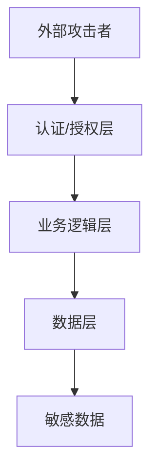

# 安全审计报告模板

## 1. 项目信息

| 项目名称 | 版本 | 负责人 | 最后更新 |
|---------|------|--------|----------|
| 项目名称 | v1.0.0 | 安全专家 | 2024-01-01 |

## 2. 安全审计概述

### 2.1 审计范围
- **审计目标**: [如：Web应用安全、API安全、数据安全等]
- **审计标准**: [如：OWASP Top 10、CWE、NIST等]
- **审计方法**: [如：静态分析、动态测试、威胁建模等]

### 2.2 威胁模型

## 3. 安全发现

### 3.1 漏洞清单

| 编号 | 严重程度 | 漏洞类型 | 位置 | 描述 | 状态 |
|------|---------|---------|------|------|------|
| SEC-001 | 高 | SQL注入 | api/users.py:42 | 用户输入未参数化 | 待修复 |
| SEC-002 | 中 | XSS | views/dashboard.html:15 | 输出未转义 | 待修复 |
| SEC-003 | 低 | 信息泄露 | config/settings.py:8 | 调试模式开启 | 待修复 |

### 3.2 OWASP Top 10 检查

| # | 风险类别 | 状态 | 说明 |
|---|---------|------|------|
| A01 | 权限控制失效 | ✅/❌ | |
| A02 | 加密机制失效 | ✅/❌ | |
| A03 | 注入攻击 | ✅/❌ | |
| A04 | 不安全设计 | ✅/❌ | |
| A05 | 安全配置错误 | ✅/❌ | |
| A06 | 过时组件 | ✅/❌ | |
| A07 | 身份认证失败 | ✅/❌ | |
| A08 | 数据完整性失败 | ✅/❌ | |
| A09 | 日志监控不足 | ✅/❌ | |
| A10 | 服务端请求伪造 | ✅/❌ | |

## 4. 安全建议

### 4.1 高优先级建议
1. [建议1]
2. [建议2]

### 4.2 中优先级建议
1. [建议1]
2. [建议2]

### 4.3 低优先级建议
1. [建议1]
2. [建议2]

## 5. 合规性检查

| 标准 | 状态 | 说明 |
|------|------|------|
| GDPR | ✅/❌ | |
| SOC2 | ✅/❌ | |
| HIPAA | ✅/❌ | |
| PCI-DSS | ✅/❌ | |

## 6. 修复跟踪

| 编号 | 负责人 | 截止日期 | 修复方案 | 验证结果 |
|------|--------|---------|---------|---------|
| SEC-001 | | | | |
| SEC-002 | | | | |
| SEC-003 | | | | |
