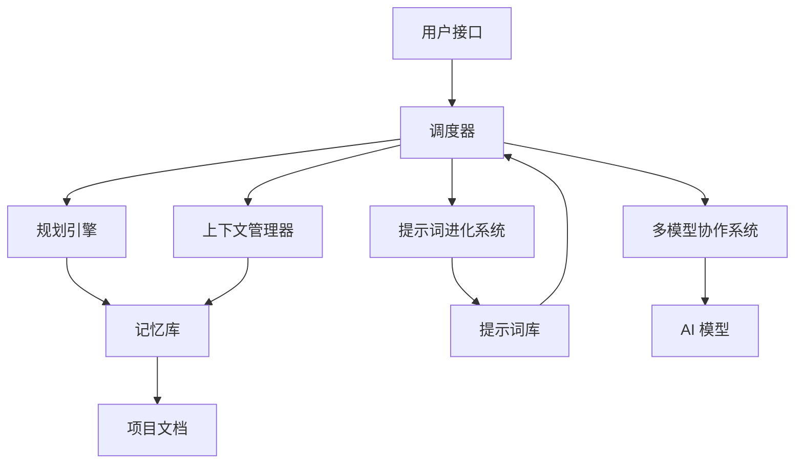

# 架构设计文档

## 1. 项目概述

本项目是 DevSquad 的 Vibe Coding 增强版本，旨在通过集成 Vibe Coding 范式，提升 AI 辅助开发的效率和质量。

## 2. 系统架构

### 2.1 整体架构



### 2.2 核心模块

| 模块 | 职责 | 功能 |
|------|------|------|
| 调度器 | 任务分配和管理 | 接收用户任务，分配给合适的模块 |
| 规划引擎 | 生成实施计划 | 分析需求，生成详细的实施计划 |
| 提示词进化系统 | 提示词生成和优化 | 生成和优化提示词，支持自我进化 |
| 上下文管理器 | 上下文管理 | 管理和注入项目上下文 |
| 多模型协作系统 | 多模型协同 | 协调多个 AI 模型的协作 |
| 记忆库 | 知识存储 | 存储项目相关文档和上下文 |
| 提示词库 | 提示词管理 | 管理和提供提示词模板 |

### 2.3 数据流

1. 用户输入任务
2. 调度器分析任务类型
3. 规划引擎生成实施计划
4. 上下文管理器注入相关上下文
5. 多模型协作系统执行任务
6. 提示词进化系统优化提示词
7. 结果反馈给用户
8. 经验沉淀到记忆库

## 3. 技术栈

| 技术 | 用途 | 版本 |
|------|------|------|
| Python | 核心语言 | 3.9+ |
| PyYAML | 配置管理 | 6.0+ |
| Markdown | 文档格式 | - |
| Mermaid | 图表生成 | - |
| Git | 版本控制 | 2.0+ |
| AI 模型 | 智能助手 | Claude Opus 4.5, GPT-5.1, Gemini 3.0 |

## 4. 模块设计

### 4.1 调度器模块

**职责**：
- 接收和解析用户任务
- 根据任务类型分配给合适的模块
- 协调各模块的工作流程
- 管理任务的生命周期

**接口**：
- `dispatch_task(task, context)`: 调度任务
- `get_task_status(task_id)`: 获取任务状态
- `cancel_task(task_id)`: 取消任务

### 4.2 规划引擎模块

**职责**：
- 分析用户需求
- 生成详细的实施计划
- 分解任务为可管理的小步骤
- 制定时间计划和优先级

**接口**：
- `generate_plan(requirements)`: 生成实施计划
- `validate_plan(plan)`: 验证计划的可行性
- `update_plan(plan, feedback)`: 更新计划

### 4.3 提示词进化系统

**职责**：
- 生成高质量的提示词
- 优化现有提示词
- 支持提示词的自我进化
- 管理提示词库

**接口**：
- `generate_prompt(task_type, context)`: 生成提示词
- `optimize_prompt(prompt, feedback)`: 优化提示词
- `evolve_prompts(iterations)`: 进化提示词

### 4.4 上下文管理器

**职责**：
- 管理项目上下文
- 注入相关上下文信息
- 维护上下文的一致性
- 优化上下文质量

**接口**：
- `get_context(task)`: 获取任务上下文
- `inject_context(prompt, context)`: 注入上下文
- `update_context(task, new_info)`: 更新上下文

### 4.5 多模型协作系统

**职责**：
- 管理多个 AI 模型
- 分配任务给合适的模型
- 整合多个模型的输出
- 优化模型协作策略

**接口**：
- `assign_task(task, models)`: 分配任务给模型
- `collaborate(models, task)`: 多模型协作
- `integrate_results(results)`: 整合结果

## 5. 数据模型

### 5.1 任务模型

```python
class Task:
    id: str
    description: str
    type: str
    status: str
    priority: str
    created_at: datetime
    updated_at: datetime
    plan: Plan
    context: Context
    results: List[Result]
```

### 5.2 计划模型

```python
class Plan:
    id: str
    task_id: str
    steps: List[Step]
    estimated_time: int
    created_at: datetime
    updated_at: datetime
```

### 5.3 上下文模型

```python
class Context:
    id: str
    task_id: str
    project_info: Dict
    memory_bank: Dict
    previous_results: List[Result]
    created_at: datetime
    updated_at: datetime
```

## 6. 部署架构

### 6.1 本地部署

- **环境**：本地开发环境
- **依赖**：Python 3.9+, PyYAML
- **配置**：本地配置文件
- **存储**：本地文件系统

### 6.2 云端部署

- **环境**：云服务器
- **依赖**：Docker, Kubernetes
- **配置**：环境变量
- **存储**：云存储

## 7. 性能与安全

### 7.1 性能优化

- **缓存机制**：缓存频繁使用的提示词和上下文
- **异步处理**：异步执行耗时任务
- **并行计算**：多模型并行处理
- **资源管理**：合理分配计算资源

### 7.2 安全考虑

- **输入验证**：验证用户输入
- **数据保护**：保护敏感信息
- **模型安全**：使用安全的 AI 模型
- **权限控制**：控制访问权限

## 8. 监控与维护

### 8.1 监控指标

- **任务执行时间**：监控任务执行时间
- **成功率**：监控任务成功率
- **资源使用**：监控系统资源使用
- **错误率**：监控错误率

### 8.2 维护计划

- **定期备份**：定期备份记忆库
- **更新提示词**：定期更新提示词库
- **优化模型**：定期优化模型选择
- **性能调优**：定期进行性能调优

## 9. 未来扩展

- **多语言支持**：支持多种编程语言
- **多模态输入**：支持图像、语音等输入
- **插件系统**：支持插件扩展
- **集成 CI/CD**：集成持续集成/部署

## 10. 结论

本架构设计提供了一个完整的 Vibe Coding 增强方案，通过规划驱动、上下文固定和 AI 结对执行，实现了从想法到可维护代码的高效转化。该架构具有良好的扩展性和可维护性，能够适应不同规模和类型的项目需求。